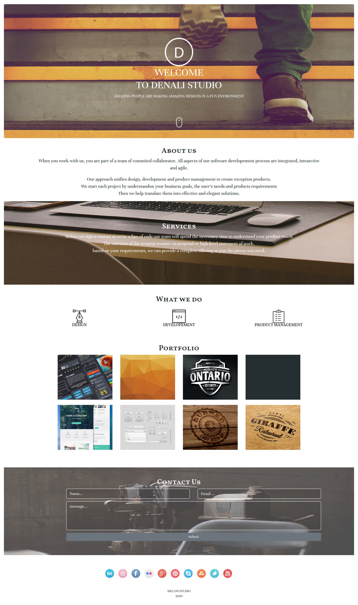

# Delani Studio
## Author
  Hi I'm **Cynthia Umutoniwabo** :relaxed:    

## Description
This project was an application that can help us practice [Bootstrap](https://getbootstrap.com/docs/4.0/getting-started/introduction/) and [jQuery](https://jquery.com/) by recreating a fictional studio landing page.

# Live Page
  
[https://ucynthy12.github.io/Delani/](https://ucynthy12.github.io/Delani/)

## Setup/Installation Requirements
*  Open Terminal {Ctrl+Alt+T}

* git clone https://github.com/ucynthy12/Delani.git 

* cd Delani-Studio

 * code . or atom . depending on the text editor of your choise.
## BDD

|Behaviour|Input|Output |  
|---------|------|------| 
for device width over 1024px | hover on porfolio image| name of the project appears|  
for touch screen devices| click on portfolio image| name of the project appears|  
To send a message| Enter name ,email and message| pop message that thank sender|
Error message| fail to enter name or email or message | alert message to fill in name or email or message|
for mouse| click on mouse| go down the page|
## Known Bugs
 This project isn't fully responsive on certain devices.
## Technologies Used
* HTML5
* CSS
* Bootstrap
* jQuery
* markdown
  
## Credits
  . [Font Awesome](https://fontawesome.com/)  
  . [Google fonts](https://fonts.google.com/)  
  . [Animte.css](https://animate.style/)

## Support and contact details

1. Email: *ucynthy12@gmail.com*
2. Github 
     .username: **ucynthy12**   
     .name: **Cynthia Umutoniwabo**

### License
Copyright (c) [2020] [Cynthia Umutoniwabo]

Permission is hereby granted, free of charge, to any person obtaining a copy
of this software and associated documentation files (the "Software"), to deal
in the Software without restriction, including without limitation the rights
to use, copy, modify, merge, publish, distribute, sublicense, and/or sell
copies of the Software, and to permit persons to whom the Software is
furnished to do so, subject to the following conditions:

The above copyright notice and this permission notice shall be included in all
copies or substantial portions of the Software.

THE SOFTWARE IS PROVIDED "AS IS", WITHOUT WARRANTY OF ANY KIND, EXPRESS OR
IMPLIED, INCLUDING BUT NOT LIMITED TO THE WARRANTIES OF MERCHANTABILITY,
FITNESS FOR A PARTICULAR PURPOSE AND NONINFRINGEMENT. IN NO EVENT SHALL THE
AUTHORS OR COPYRIGHT HOLDERS BE LIABLE FOR ANY CLAIM, DAMAGES OR OTHER
LIABILITY, WHETHER IN AN ACTION OF CONTRACT, TORT OR OTHERWISE, ARISING FROM,
OUT OF OR IN CONNECTION WITH THE SOFTWARE OR THE USE OR OTHER DEALINGS IN THE
SOFTWARE.